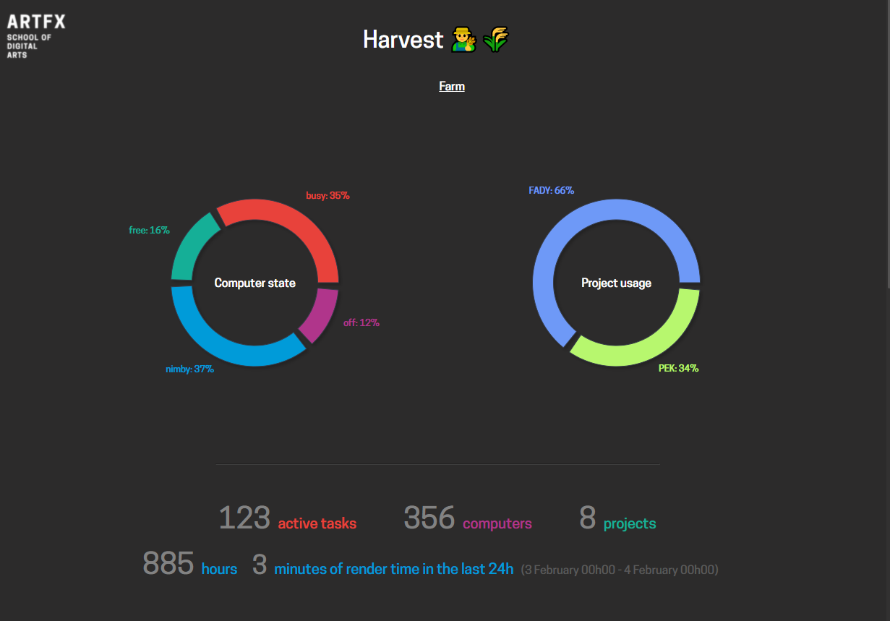

# Harvest UI 👨‍🌾🌾

      

<br>

<p align="center">
  
  <br><br>
  Statistics dashboard for Pixar's Tractor render farm<br>
</p>

<br>

## Introduction

Harvest is a realtime front-end application to display useful statistics for the Tractor render farm.

It connects to [`harvest-api`](https://github.com/ArtFXDev/harvest-api) which is the backend API.

It's built on the great [Recharts](https://recharts.org) library for graphics, uses [Sass](https://sass-lang.com/) for the styling and powerful type system with [TypeScript](typescriptlang.org/) and [React](reactjs.org/).

## Installation

The package manager used is [Yarn](https://yarnpkg.com/). Clone the repository and install the dependencies:

```bash
$ git clone https://github.com/ArtFXDev/harvest-ui
$ cd harvest-ui
$ yarn install # Install the dependencies
```

## Usage

### Environment variables

Before starting the UI, make sure the variables defined in the [`.env`](.env) file are correct.

They are:

- `REACT_APP_HARVEST_API_URL` - the url of the Harvest backend API.

### Available scripts

- 🚀 `yarn start` -> runs the [Webpack](https://webpack.js.org/configuration/dev-server/) development server with HMR (hot module replacement).

  You can then access the app on [`http://localhost:3000`](http://localhost:3000).

- 👷 `yarn build` -> builds and bundle the whole app in a `build` folder. It is used to host the static files on a web server like Nginx or Apache.

- 🔨 `yarn tsc` -> runs the TypeScript compiler and report errors. Add `:watch` to run an interactive process that watches file changes.

- 💅 `yarn prettify` -> prettify the code with Prettier. Add `:write` to write the modifications.

- 🚨 `yarn lint` -> shows ESLint warnings and errors. Add `:fix` to apply auto fixes.

## Libraries

Here are the main libraries and packages used:

| Library                                       | Version  |
| --------------------------------------------- | -------- |
| [React](https://reactjs.org/)                 | `17.0.2` |
| [TypeScript](https://www.typescriptlang.org/) | `4.5.5`  |
| [React router](https://reactrouter.com/)      | `6.2.1`  |
| [Recharts](https://recharts.org/)             | `2.1.8`  |
| [Sass](https://sass-lang.com/)                | `1.49.7` |

## Contributing

Pull requests and issues are welcome. For major changes, please open an issue first to discuss what you would like to change.

## License

[MIT](./LICENSE.md) [@ArtFX](https://artfx.school/)
